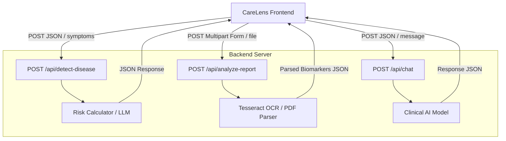

# CareLens AI Backend Integration Guide

This document describes how the CareLens AI frontend connects to a real backend API, enabling symptom analysis, OCR report parsing, and AI-driven clinical chat sessions.

---

## 1. Architectural Data Flow

CareLens AI acts as a single-page or multi-page static client that communicates asynchronously with a backend server (e.g., Node.js/Express or Python/FastAPI) over HTTP/HTTPS:



---

## 2. API Endpoint Specifications

### A. Symptom Risk Analysis
* **Endpoint**: `POST /api/detect-disease`
* **Content-Type**: `application/json`
* **Description**: Processes active symptoms and custom text inputs, and calculates risk score level.
* **Payload Structure**:
  ```json
  {
    "patientId": "amara-reid-492",
    "symptoms": ["Fatigue", "Chest pain"],
    "customInput": "Feeling mild shortness of breath and a persistent headache.",
    "timestamp": "2026-05-22T12:00:00.000Z"
  }
  ```
* **Response Structure**:
  ```json
  {
    "success": true,
    "riskScore": 68,
    "riskLevel": "High",
    "aiDiagnostics": "High risk profile matching cardio-stress indicators. Urgent clinical review is advised.",
    "recommendations": [
      "Contact your healthcare provider immediately or dial emergency support.",
      "Rest in an upright posture and monitor oxygen levels."
    ]
  }
  ```

### B. OCR Document Processing
* **Endpoint**: `POST /api/analyze-report`
* **Content-Type**: `multipart/form-data`
* **Description**: Takes a raw lab report file (PDF or image) and returns OCR-extracted text parameters.
* **Multipart Field**: `report` (file)
* **Response Structure**:
  ```json
  {
    "success": true,
    "message": "Multipart file parsed successfully via Tesseract OCR engine",
    "extractedText": "Extracted medical observations:\n- Blood pressure: 118/76 mmHg (Normal)\n- Stable heart rate: 72 bpm\n- No abnormal markers or elevated flags detected"
  }
  ```

### C. Interactive Clinical Chat
* **Endpoint**: `POST /api/chat`
* **Content-Type**: `application/json`
* **Description**: Allows a patient to chat with the clinical virtual assistant.
* **Payload Structure**:
  ```json
  {
    "message": "What should I do for a fever of 101F?",
    "timestamp": "2026-05-22T12:05:00.000Z"
  }
  ```
* **Response Structure**:
  ```json
  {
    "success": true,
    "reply": "For a temperature of 101°F, keep active fluid intake (hydration) and track hourly. Seek immediate medical attention if you experience severe headaches or shortness of breath.",
    "model": "CareLens-MedLLM-v2"
  }
  ```

---

## 3. Frontend Fetch Implementations (`js/`)

Below are the exact `fetch()` calls you can implement in your frontend JS scripts to connect to a live backend.

### Fetch Call for Symptoms Scan
```javascript
async function sendSymptomAnalysis(payload) {
  try {
    const response = await fetch('http://localhost:3000/api/detect-disease', {
      method: 'POST',
      headers: {
        'Content-Type': 'application/json',
        'Authorization': 'Bearer YOUR_JWT_TOKEN_HERE'
      },
      body: JSON.stringify(payload)
    });
    
    if (!response.ok) throw new Error(`HTTP error! status: ${response.status}`);
    const data = await response.json();
    return data; // contains riskScore, riskLevel, and recommendations
  } catch (error) {
    console.error('Failed to analyze symptoms:', error);
  }
}
```

### Fetch Call for OCR Multipart Upload
```javascript
async function uploadReportFile(file) {
  const formData = new FormData();
  formData.append('report', file); // field matches backend upload key

  try {
    const response = await fetch('http://localhost:3000/api/analyze-report', {
      method: 'POST',
      // Note: Do NOT set Content-Type header manually for FormData.
      // The browser automatically sets it with the proper multipart boundary.
      body: formData
    });
    
    if (!response.ok) throw new Error(`HTTP error! status: ${response.status}`);
    const data = await response.json();
    return data; // contains extractedText and parsed markers
  } catch (error) {
    console.error('Failed to upload report:', error);
  }
}
```

---

## 4. Backend Example (Node.js & Express)

Here is a ready-to-run Node.js reference implementation using Express, CORS, and `multer` for handling document uploads.

### Initializing the Project
To run this server locally:
```bash
npm init -y
npm install express cors multer dotenv
```

### Server Code (`server.js`)
```javascript
const express = require('express');
const cors = require('cors');
const multer = require('multer');
const path = require('path');

const app = express();
const PORT = process.env.PORT || 3000;

// Enable CORS so the local frontend (port 5500 / 8080) can communicate with it
app.use(cors({
  origin: '*', // in production, replace with your frontend URL
  methods: ['GET', 'POST', 'PUT', 'DELETE'],
  allowedHeaders: ['Content-Type', 'Authorization']
}));

app.use(express.json());

// Setup Multer for handling file uploads (saved in 'uploads/' directory)
const upload = multer({
  dest: 'uploads/',
  limits: { fileSize: 5 * 1024 * 1024 }, // limit to 5MB
  fileFilter: (req, file, cb) => {
    const allowedTypes = ['.pdf', '.jpg', '.jpeg', '.png'];
    const ext = path.extname(file.originalname).toLowerCase();
    if (allowedTypes.includes(ext)) {
      cb(null, true);
    } else {
      cb(new Error('Only images and PDFs are allowed'));
    }
  }
});

// Route 1: Symptoms Analyzer
app.post('/api/detect-disease', (req, res) => {
  const { symptoms, customInput } = req.body;
  
  // Custom simple risk scoring model
  let score = 20;
  if (symptoms && symptoms.length > 0) {
    symptoms.forEach(s => {
      const lower = s.toLowerCase();
      if (lower.includes('chest')) score += 40;
      else if (lower.includes('shortness')) score += 30;
      else if (lower.includes('fever')) score += 20;
      else score += 10;
    });
  }

  score = Math.min(score, 99);
  
  const isHigh = score >= 60;
  const isMod = score >= 30;

  res.status(200).json({
    success: true,
    riskScore: score,
    riskLevel: isHigh ? 'High' : (isMod ? 'Moderate' : 'Low'),
    aiDiagnostics: isHigh 
      ? 'High probability of cardio-stress. Consult doctor.' 
      : 'Stable profile. Hydration and rest are recommended.',
    recommendations: isHigh 
      ? ['Contact provider', 'Avoid physical activity'] 
      : ['Drink 2L fluids', 'Log symptoms in the morning']
  });
});

// Route 2: OCR Document Upload and Parser
app.post('/api/analyze-report', upload.single('report'), (req, res) => {
  if (!req.file) {
    return res.status(400).json({ success: false, message: 'No file uploaded.' });
  }

  // In a real application, you would invoke an OCR tool (e.g. node-tesseract-ocr or Python subprocess)
  // Example mock extraction output:
  res.status(200).json({
    success: true,
    message: "Multipart file parsed successfully",
    filename: req.file.originalname,
    extractedText: `Extracted observations from ${req.file.originalname}:\n- Blood pressure: 118/76 mmHg (Normal)\n- Stable heart rate: 72 bpm\n- No abnormal markers or elevated flags detected`
  });
});

// Route 3: Assistant Chatbot
app.post('/api/chat', (req, res) => {
  const { message } = req.body;
  const lower = message.toLowerCase();
  
  let reply = "I've noted that. Please provide more details or ask a follow-up query.";
  if (lower.includes('chest') || lower.includes('pain')) {
    reply = "Chest pain is a critical concern. Please check our Emergency SOS button or seek primary care services immediately.";
  } else if (lower.includes('fever')) {
    reply = "Keep track of body temperature. Hydrate well and rest in a cool environment.";
  }

  res.status(200).json({
    success: true,
    reply: reply,
    model: "CareLens-MedLLM-v2"
  });
});

// Error handling middleware
app.use((err, req, res, next) => {
  res.status(500).json({ success: false, message: err.message });
});

app.listen(PORT, () => {
  console.log(`CareLens API Server running at http://localhost:${PORT}`);
});
```

---

## 5. Security & Production Considerations

1. **CORS (Cross-Origin Resource Sharing)**: Configure the `cors` middleware explicitly to only trust the domain where the CareLens frontend is hosted (e.g. `https://carelens-app.web.app`).
2. **Authentication**: Require a JWT (JSON Web Token) in the `Authorization` header (`Bearer <token>`) for endpoints containing sensitive patient data, verifying identity before calculating triage risk.
3. **File Verification**: Validate magic numbers (file header signatures) of uploaded reports rather than trusting raw filenames to prevent arbitrary file execution attacks.
